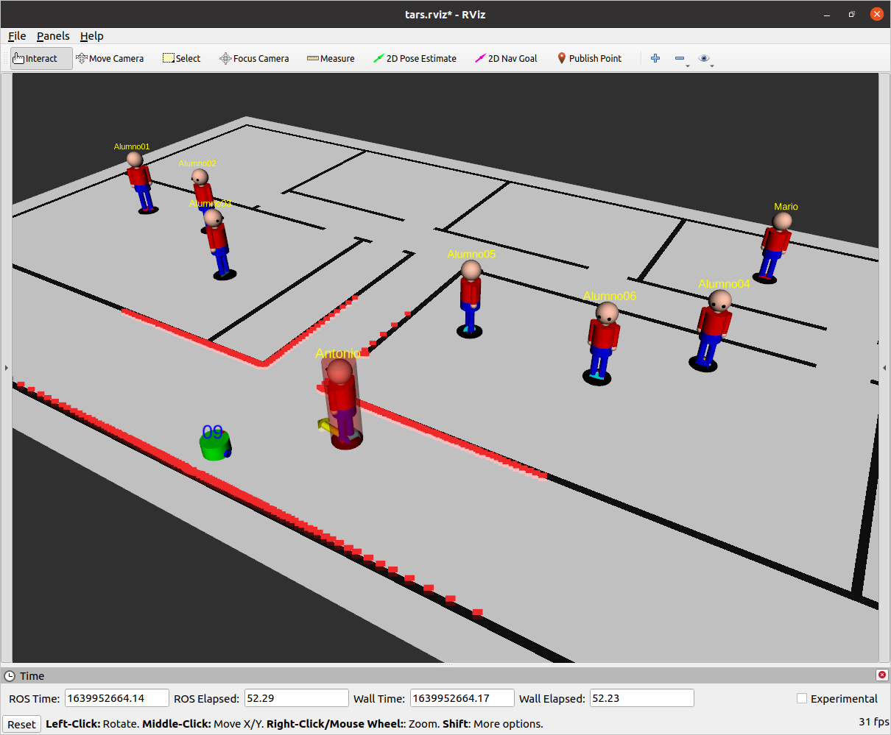

# TARS is Another Robot Simulator
A ROS multi-agent simulator based on the Social Force Model (SFM). It includes two types of agents:

* **Humans** move randomly between points of interest following the A* algorithm for global planning and the SFM for local planning. The desired velocity and the list of points of interest in the map can be configured individually for each agent.

* Dual-wheeled **robots** following velocity commands. Each robot publish its own odometry, laser scan and people detection. Each one is subscribed to its own *cmd_vel* topic to receive velocity commands. The robot radius, number of laser scan readings, laser scan range and people detection range can be configured individually for each one.

The simulator is lightweight and includes cool RVIZ visualization, the number of dependencies has been minimized for optimal execution. It has been developed using ROS Noetic, but it has been successfully tested on ROS Melodic and Kinetic. 

## Installation and quick start

The package *map_server* is recommended for map visualization (but not mandatory). Clone this repository in the source folder of your catkin workspace and compile with catkin_make.

cd \~/catkin_ws/src

git clone https://github.com/Ignacio-Perez/TARS 

cd ..

catkin_make

